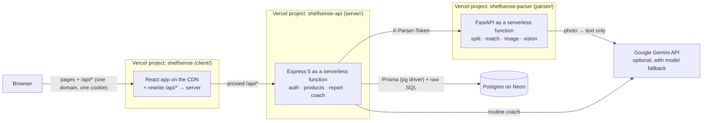

# ShelfSense

**Scan the ingredient labels of the skincare you already own. ShelfSense tells you what clashes, what you're doubling up on and what your routine is missing — then builds a morning and evening routine using only the products on your shelf.**


**Live:** _add your Vercel URL here_ · **Demo:** press **Demo** / **Try the demo** anywhere on the site (read-only sample shelf, no sign-up)


<details>
<summary>Light theme</summary>


</details>

---

## What it does

| | |
| --- | --- |
| **Scan, upload or paste a label** | Three ways in, one pipeline. Photos are tidied with Pillow, read by Gemini, then matched by our own parser. |
| **Review screen with confidence colours** | Green = matched, yellow = please check, red = unknown. Tap any chip to fix it before saving. |
| **Clash detector** | "Your retinol serum and glycolic toner are both in your PM routine — high irritation risk." One raw SQL self-join. |
| **Doubles detector** | "Niacinamide is in 2 of your products (2nd ingredient in one, 4th in the other)." Label position, never guessed percentages. |
| **Gap finder** | "No sunscreen in your morning routine." A `NOT EXISTS` query per rule. |
| **Routine coach** | Builds an AM/PM plan from your products only, putting clashing ones on different nights. Guarded, validated and cached. |
| **Accounts** | Email + password, bcrypt, server-side sessions in Postgres, httpOnly cookies. |
| **Always-on demo** | A read-only sample shelf, one click away from the header, the home page, login and sign-up. |
| **Light and dark themes** | Follows your system setting, with a toggle in the header that remembers your choice. |

<table>
  <tr>
    <td></td>
    <td></td>
  </tr>
  <tr>
    <td colspan="2"></td>
  </tr>
</table>

---

## Architecture



**One domain for the browser.** The site and `/api/*` share an address: the web project *rewrites* (proxies) `/api/*` to the API project. The session cookie belongs to one site, so there's no CORS and no cross-site cookie setup. Locally, Vite's dev proxy does the same job.

**The flow of a photo:** browser → Express (Multer, in memory, 4 MB cap, login required) → FastAPI (Pillow fixes rotation, shrinks to 1568px, re-encodes as JPEG) → Gemini copies the ingredient text → our `split.py` + `match.py` turn it into matched ingredients → review screen → saved in one transaction. The photo is never written to disk.

**The flow of a report:** three SQL queries (conflicts, doubles, gaps) run in parallel against the rules tables. Every finding points back to a row in `interaction_rules`, `gap_rules` or `ingredient_classes`.

---

## Tech stack

| Part | Tools |
| --- | --- |
| Monorepo | npm workspaces (`client`, `server`, `shared`) |
| Client (`client/`) | React 19, Vite, TypeScript (strict), TanStack Router (code-based), TanStack Query, Tailwind CSS v4 |
| Server (`server/`) | Node 22, Express 5, TypeScript (strict), Prisma (engine-free, `pg` driver adapter), bcryptjs, cookie-parser, Multer (memory storage), express-rate-limit, Google Gen AI SDK |
| Shared types (`shared/`) | Plain TypeScript types for every request/response, imported with `import type` |
| Validation | Hand-written validators + type guards in `server/src/validators/validate.ts` |
| Parser (`parser/`) | Python 3.12, FastAPI, Pillow, RapidFuzz, Pydantic, Google Gen AI SDK; psycopg + bcrypt for the seed script |
| Database | PostgreSQL (Neon in production) |
| Tests | Vitest + Supertest (server, against a real test database), pytest (parser) |
| CI/CD | GitHub Actions → Vercel (3 projects, auto-deploy on push) |

---

## Project structure

```
shelfsense/
├── package.json              npm workspaces + root scripts (dev, test, build, db:*)
├── client/                   React app (Vite)
│   ├── public/               favicon + hand-drawn SVG illustrations (light + dark)
│   ├── src/pages/            Landing, Login, Signup, Shelf, Report, NotFound
│   ├── src/components/       AddProductDrawer, ScanInput, IngredientReview, FindingCard, CoachPanel, …
│   ├── src/lib/              api (typed fetch), auth, shelf (queries), theme, labels
│   └── vercel.json           rewrite /api/* to the server project + SPA fallback
├── server/                   Express API
│   ├── prisma/               schema.prisma + migrations
│   ├── src/app.ts            builds the Express app (also Vercel's entry point)
│   ├── src/index.ts          starts it locally (listen)
│   ├── src/routes/           auth, parse, products, report, coach          ← controllers
│   ├── src/services/         analysis/ (SQL), coach/, products, sessions, users   ← business logic
│   ├── src/validators/       validate.ts - every input check
│   ├── src/middleware/       requireAuth (+ blockDemo), errorHandler, rateLimit
│   ├── src/lib/              db, env, httpError, llm (Gemini), parserClient  ← infrastructure
│   ├── src/types/            express.d.ts (adds req.user)
│   └── test/                 auth, analysis, coach, llm tests
├── shared/                   types shared by client and server
├── parser/                   Python FastAPI label parser
│   ├── app/                  main, split, match, image, vision, models, config
│   ├── data/                 ingredients, classes, rules, gap rules, demo shelf (JSON)
│   ├── scripts/              seed.py, try_vision.py
│   ├── tests/
│   ├── requirements.txt      what it needs to run (all Vercel installs)
│   ├── requirements-dev.txt  + tests, lint, seeding
│   └── vercel.json
└── .github/
    ├── workflows/ci.yml
    └── screenshots/
```

---

## Run it locally

You need **Node 22** (npm comes with it), **Python 3.12+**, **Git**, and a **Postgres** database (a free [Neon](https://neon.com) project, or Postgres on your machine).

### 1. Install

```bash
npm install                      # client, server and shared in one go

cd parser
python -m venv .venv
source .venv/bin/activate        # Windows: .venv\Scripts\activate
pip install -r requirements-dev.txt
cd ..
```

### 2. Environment variables

```bash
cp server/.env.example server/.env
cp server/.env.test.example server/.env.test
cp parser/.env.example parser/.env
```

(Windows PowerShell: use `Copy-Item` instead of `cp`.)

- Put your database URL in `server/.env` and a **second, separate** database URL in `server/.env.test` (the tests create and delete rows).
- Use the same long random `PARSER_TOKEN` in `server/.env` and `parser/.env`. Make one with `node -e "console.log(require('crypto').randomBytes(24).toString('hex'))"`
- `GEMINI_API_KEY` is **optional** (free key at [Google AI Studio](https://aistudio.google.com/apikey)). Without it, everything works except reading photos, and the coach uses the built-in rule-based routine builder.
- `GEMINI_MODEL` is a comma-separated list, tried in order. If one model is rate limited (429) or overloaded (503), the next one is used.

### 3. Database

```bash
npm run db:migrate                              # creates the tables
cd parser && python scripts/seed.py && cd ..    # ingredients, rules and the demo shelf
```

For the test database:

```bash
# macOS / Linux
DATABASE_URL="<test db url>" npm run db:deploy
# Windows PowerShell
$env:DATABASE_URL="<test db url>"; npm run db:deploy; Remove-Item Env:DATABASE_URL

cd parser && python scripts/seed.py --env-file ../server/.env.test && cd ..
```

### 4. Start it (two terminals)

```bash
# terminal 1 - repo root
npm run dev                       # client on http://localhost:5173, server on :3000

# terminal 2 - parser/, venv active
uvicorn app.main:app --reload --port 8001
```

Open **http://localhost:5173** and press **Demo**.

To try the camera on your phone, run `npm run dev -w client -- --host` and open the "Network" address it prints on your phone (same Wi-Fi).

### Checks

```bash
npm run typecheck                 # TypeScript in client, server and shared
npm test                          # Vitest + Supertest (needs the test database)
npm run build                     # production build of client + server
cd parser && ruff check . && pytest
```

> **Windows:** stop `npm run dev` before `npm run build`, or Windows may refuse to overwrite a file the running server has open.

---

## Deploy (Vercel + Neon)

Three Vercel projects from this one repo. Each is **Add New → Project → import the repo → set Root Directory**:

| Project name (suggested) | Root Directory | Framework (auto-detected) | Environment variables |
| --- | --- | --- | --- |
| `shelfsense-parser` | `parser` | FastAPI | `PARSER_TOKEN`, `GEMINI_API_KEY`, `GEMINI_MODEL` |
| `shelfsense-api` | `server` | Express | `DATABASE_URL`, `PARSER_URL`, `PARSER_TOKEN`, `GEMINI_API_KEY`, `GEMINI_MODEL` |
| `shelfsense` | `client` | Vite | — |

1. **Database:** create the Neon project in **AWS Asia Pacific (Singapore)** — the functions run in Vercel's Singapore region (`sin1`, set in `server/vercel.json` and `parser/vercel.json`), and the server and database should sit next to each other. Use the **production** branch for the live site. From your machine, create the tables and load the data with its **direct** connection string:
   ```bash
   DATABASE_URL="<neon direct url>" npm run db:deploy
   cd parser && DATABASE_URL="<neon direct url>" python scripts/seed.py
   ```
   (Windows PowerShell: set `$env:DATABASE_URL="..."` first, then run the commands.)
2. **Parser first:** create `shelfsense-parser` and deploy it. Copy its URL.
3. **API:** create `shelfsense-api`. Set `DATABASE_URL` to Neon's **pooled** connection string (production branch, pooling ON), `PARSER_URL` to the parser's URL, the same `PARSER_TOKEN` as the parser, and your Gemini key. Copy its URL.
4. **Client:** in `client/vercel.json`, replace `REPLACE-WITH-YOUR-API-PROJECT.vercel.app` with the API's address, commit, push, then create the `shelfsense` project.
5. Open the `shelfsense` URL → **Demo**. Every push to `main` redeploys whatever changed.

**Limits worth knowing (free Hobby plan):** request bodies max 4.5 MB (so photos are capped at 4 MB), functions run up to 300 s, and rate limits are counted per running copy of the function (fine for a portfolio; a shared store like Upstash Redis would make them exact).

---

## Design decisions

1. **Python for scanning and matching, Node for the app.** Python has the best image and fuzzy-matching libraries; Node + Express serves the API with shared TypeScript types. They talk over one small HTTP contract.
2. **The LLM reads, our code decides.** Gemini only copies text off the photo. Matching is our own deterministic parser, so it's testable and gives the same answer every time.
3. **Why a vision model instead of Tesseract.** Classic OCR struggles with curved, shiny, tiny-print bottle labels. We shrink the image first to keep the cost low, and the review screen catches mistakes.
4. **Rules live in the database, not in code.** Adding a rule is a data change, not a redeploy.
5. **One raw SQL query for conflicts.** A self-join over a CTE is clearer and faster than nested loops in TypeScript.
6. **Label position, not percentages.** Labels list ingredients from most to least (below ~1% the order is free), so position is the honest signal. We never guess a percentage.
7. **A grounded, guarded, cached coach (Gemini, with model fallback).** It only rewrites findings our SQL produced. The reply is checked by a type guard, every product name must exist on the shelf (one retry, then a clean error), and results are cached by a sha256 of the inputs. If a model is rate limited it tries the next one in `GEMINI_MODEL`; with no API key it falls back to a rule-based builder.
8. **Sessions in Postgres + httpOnly cookies, not JWTs in localStorage.** Page JavaScript can't read the cookie, sessions can be revoked instantly, and only a hash of each token is stored.
9. **Hand-written validation instead of a library.** Every rule is a few visible lines. In a bigger app I'd move to a schema library to cut the repetition.
10. **Photos are never stored.** Less privacy risk, no storage bucket to manage, nothing to leak.
11. **Vercel instead of an always-on server.** Free, no 30–60 s cold start like sleeping free servers, auto-deploys from GitHub. Prisma runs engine-free (the `pg` driver adapter), so there's no native binary to bundle into a serverless function.

## Security notes

- bcrypt (cost 12) for passwords; login gives the same error and takes the same time for "no such email" and "wrong password".
- Session tokens are 32 random bytes; the database stores only their sha256.
- Cookies are `httpOnly`, `SameSite=Lax`, and `Secure` in production.
- Rate limits on login/signup, the demo button, parsing and the coach.
- Every product query filters by the logged-in user; delete is a single `DELETE … WHERE id = ? AND user_id = ?`.
- The demo account is read-only on the server (`blockDemo`), not just greyed out in the UI.
- All SQL uses Prisma or `$queryRaw` tagged templates — user input is always a bound parameter.
- The parser only answers requests carrying the secret `X-Parser-Token`, compared in constant time.

## What I'd build next

- "Why is this a conflict?" pop-ups showing the exact rule row.
- A doubles detail view comparing where the ingredient sits on each label.
- Password reset by email.
- A larger ingredient dictionary and an admin screen for editing rules.
- Exact rate limits across serverless copies with a shared Redis store.
