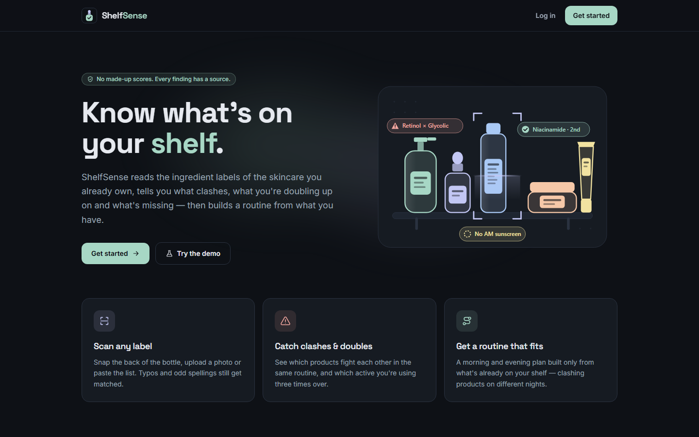
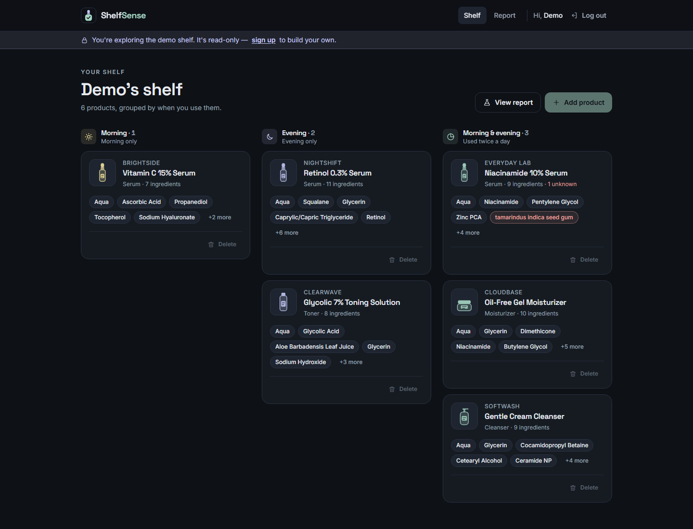
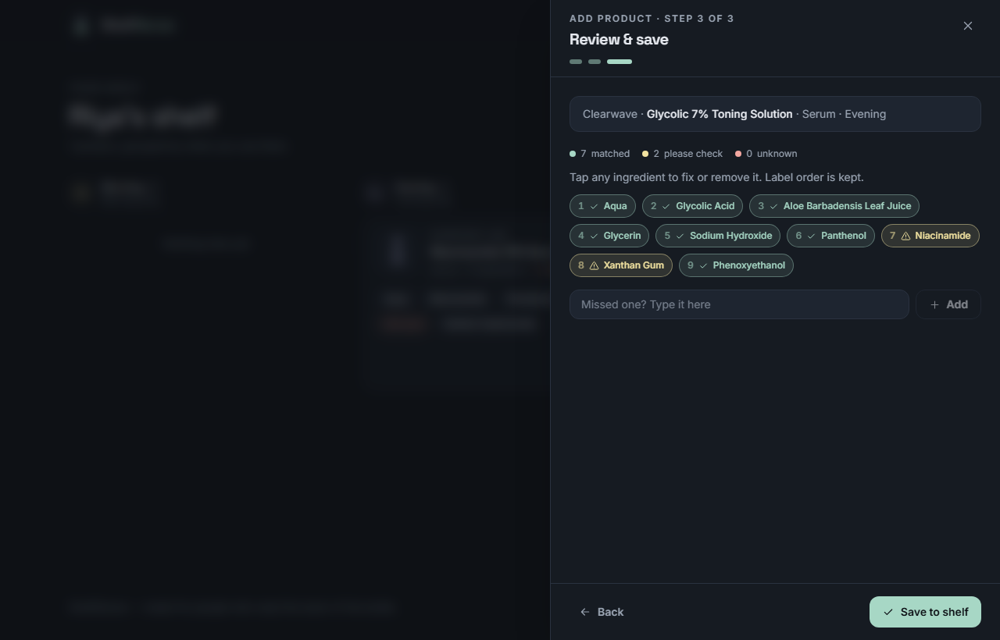
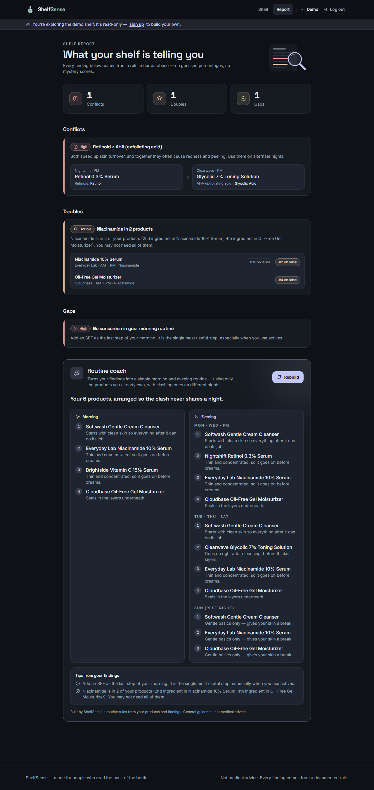
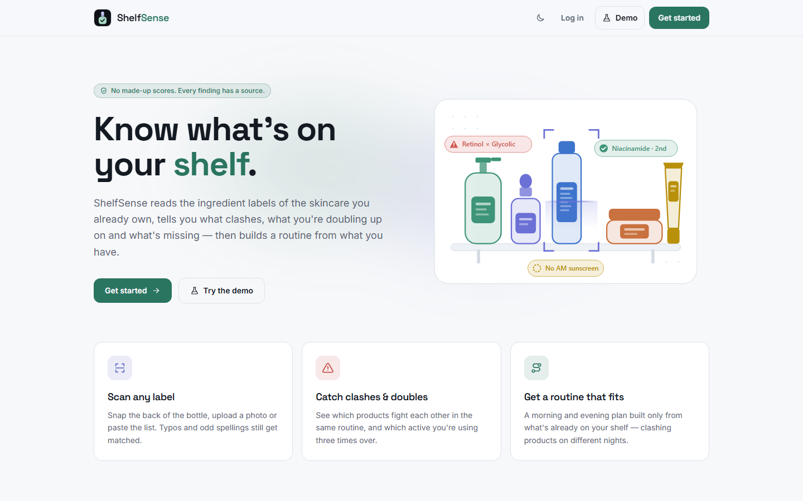
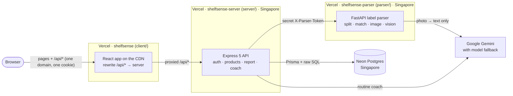

<div align="center">


# ShelfSense

**Know what's on your shelf.**

Scan the ingredient labels of the skincare you already own. ShelfSense finds what **clashes**, what you're **doubling up on** and what's **missing**, then builds a morning and evening routine using **only the products you have**.

<a href="https://shelfsense-wine-kappa.vercel.app"></a>
&nbsp;
<a href="https://github.com/Sangupta03/Shelfsense/actions/workflows/ci.yml"></a>


<br /><br />



</div>

> [!TIP]
> **Try it in 30 seconds:** open the [live site](https://shelfsense-wine-kappa.vercel.app) and press **Demo**. You get a read-only sample shelf with a real clash, a double and a missing step, no sign-up needed.

## Contents

[How it works](#-how-it-works) · [Highlights](#-highlights) · [Screenshots](#-screenshots) · [Features](#-features) · [Architecture](#-architecture) · [Tech stack](#-tech-stack) · [Run it locally](#-run-it-locally) · [Deploy](#-deploy) · [Design decisions](#-design-decisions) · [Security](#-security) · [What's next](#-whats-next)

---

## 🧴 How it works

| 1. Add your products | 2. ShelfSense checks them | 3. Get your routine |
| --- | --- | --- |
| Paste the ingredient list, upload a photo of the label, or scan it with your phone's camera. Then check the matched ingredients before saving. | It compares everything on your shelf against a set of skincare rules: products that **clash**, active ingredients you're **using twice**, and **gaps** like no morning sunscreen. | A morning and evening plan that uses **only your products** and puts clashing ones on **different nights**. |

Every finding comes from a written rule, and the app never invents scores or percentages.

## ⭐ Highlights

- **Full stack in three languages:** React + TypeScript website, Express + TypeScript API, Python label parser, one Postgres database.
- **SQL does the thinking:** clashes, doubles and gaps are three hand-written SQL queries (a self-join, `GROUP BY … HAVING`, `NOT EXISTS`) over rules stored in the database.
- **AI used carefully:** Gemini only *copies* text from photos and *writes up* findings. Its answers are type-checked, every product it names must really be on your shelf, answers are cached, and if one model is busy or rate-limited it switches to the next. It runs on Gemini's **free tier**; when every model is busy, the user gets a clear message within ~15 s and can paste the text instead.
- **Photo-friendly:** phone photos are shrunk in the browser before upload (usually to ~300 KB), and anything still over 4 MB gets a clear size message.
- **Secure by default:** bcrypt passwords, hashed session tokens in httpOnly cookies, rate limits, ownership checks on every query, and photos that are never stored.
- **89 automated tests** (34 server, 55 parser) run by GitHub Actions on every push.
- **Deployed for free on Vercel + Neon in Singapore**, close to its users, with light and dark themes and a phone-friendly layout.

## 📸 Screenshots

<table>
  <tr>
    <td width="50%"><p align="center"><sub><b>Your shelf</b>, grouped by when you use each product</sub></p></td>
    <td width="50%"><p align="center"><sub><b>Review step</b>: green = matched, yellow = please check, red = unknown</sub></p></td>
  </tr>
  <tr>
    <td colspan="2"><p align="center"><sub><b>The report</b>: a clash, a double, a gap, and a routine that splits the clashing products across nights</sub></p></td>
  </tr>
</table>

<details>
<summary><b>Light theme</b></summary>
<br />

</details>

## 🧩 Features

| Feature | What you get |
| --- | --- |
| **Three ways to add a product** | Paste the list, upload a photo, or open your phone's camera straight from the page. |
| **Review before saving** | Each ingredient is a coloured chip you can tap to fix, confirm or remove. Typos like "Niacinam1de" are still recognised. |
| **Clash detector** | *"Your retinol serum and glycolic toner are both in your evening routine — high irritation risk."* |
| **Doubles detector** | *"Niacinamide is in 2 of your products (2nd ingredient in one, 4th in the other)."* Label position, never guessed percentages. |
| **Gap finder** | *"No sunscreen in your morning routine."* |
| **Routine coach** | A morning and evening plan written by Gemini, or by built-in rules when there's no API key. |
| **Accounts and demo** | Private shelves behind a secure login, plus a one-click, read-only demo shelf. |
| **Light and dark themes** | Follows your system setting, with a toggle that remembers your choice. |

## 🏗️ Architecture



- **One domain for the browser.** The website forwards (rewrites) `/api/*` to the server project, so the login cookie belongs to one site: no CORS, no cross-site cookies.
- **A photo's journey:** browser → Express (login required, kept in memory, 4 MB max) → FastAPI (Pillow fixes rotation and shrinks it) → Gemini copies the ingredient text → my parser splits and matches it → you review it → saved in one transaction. **The photo is never stored.**
- **A report:** three SQL queries run in parallel against the rules tables, and every finding points back to a rule row.
- **Why three Vercel projects:** a static website, a Node.js function and a Python function are built and run differently. Splitting them also means only the server knows the database address, and the website holds no secrets at all.

## 🧰 Tech stack

| Part | Tools |
| --- | --- |
| **Client** `client/` | React 19, Vite, TypeScript (strict), TanStack Router, TanStack Query, Tailwind CSS v4 |
| **Server** `server/` | Node 22, Express 5, TypeScript (strict), Prisma (engine-free, `pg` driver), bcryptjs, Multer, express-rate-limit, Google Gen AI SDK |
| **Shared types** `shared/` | One set of TypeScript types for every request and response, used by client and server |
| **Parser** `parser/` | Python 3.12, FastAPI, Pillow, RapidFuzz, Pydantic, Google Gen AI SDK |
| **Database** | PostgreSQL on Neon (Singapore) |
| **Tests** | Vitest + Supertest against a real test database, pytest, Ruff |
| **CI/CD** | GitHub Actions on every push → Vercel auto-deploys |
| **Monorepo** | npm workspaces |

<details>
<summary><b>Project structure</b></summary>

```
shelfsense/
├── package.json              npm workspaces + scripts (dev, test, build, db:*)
├── client/                   React app (Vite)
│   ├── public/               favicon + SVG illustrations (light + dark)
│   ├── src/pages/            Landing, Login, Signup, Shelf, Report, NotFound
│   ├── src/components/       AddProductDrawer, ScanInput, IngredientReview, FindingCard, CoachPanel, …
│   ├── src/lib/              api (typed fetch), auth, shelf, theme, labels
│   └── vercel.json           /api/* → server + single-page-app fallback
├── server/                   Express API
│   ├── prisma/               schema.prisma + migrations
│   ├── src/app.ts            builds the app (Vercel's entry point)
│   ├── src/index.ts          starts it locally
│   ├── src/routes/           auth, parse, products, report, coach        ← controllers
│   ├── src/services/         analysis (SQL), coach, products, sessions   ← business logic
│   ├── src/validators/       every input check
│   ├── src/middleware/       requireAuth, errorHandler, rateLimit
│   ├── src/lib/              db, env, errors, Gemini client, parser client
│   ├── src/generated/        Prisma client (generated on install, not committed)
│   ├── test/                 auth, analysis, coach, llm tests
│   └── vercel.json           region: Singapore
├── shared/                   types shared by client and server
├── parser/                   Python label parser
│   ├── app/                  main, split, match, image, vision, models, config
│   ├── data/                 ingredients, classes, rules, gap rules, demo shelf (JSON)
│   ├── scripts/              seed.py, try_vision.py
│   ├── tests/
│   ├── requirements.txt      what it needs to run
│   ├── requirements-dev.txt  + tests, linting, seeding
│   └── vercel.json           region: Singapore
└── .github/workflows/ci.yml
```
</details>

## 💻 Run it locally

**You need:** Node 22 (npm comes with it), Python 3.12+, Git and a Postgres database (a free [Neon](https://neon.com) project works).

**1. Install**
```bash
npm install                        # client, server and shared

cd parser
python -m venv .venv
source .venv/bin/activate          # Windows: .venv\Scripts\activate
pip install -r requirements-dev.txt
cd ..
```

**2. Settings**: copy the example files (Windows PowerShell: `Copy-Item` instead of `cp`):
```bash
cp server/.env.example server/.env
cp server/.env.test.example server/.env.test
cp parser/.env.example parser/.env
```
- `DATABASE_URL`: your database in `server/.env`, and a **separate** one in `server/.env.test` (the tests add and delete rows).
- `PARSER_TOKEN`: the same random value in `server/.env` and `parser/.env`. Make one with `node -e "console.log(require('crypto').randomBytes(24).toString('hex'))"`.
- `GEMINI_API_KEY`: *optional*, free at [Google AI Studio](https://aistudio.google.com/apikey). Without it everything works except reading photos, and the coach uses its built-in rules.

**3. Database**
```bash
npm run db:migrate                                # create the tables
cd parser && python scripts/seed.py && cd ..      # ingredients, rules and the demo shelf
```

**4. Start** (two terminals)
```bash
npm run dev                                       # terminal 1 → http://localhost:5173
cd parser && uvicorn app.main:app --port 8001     # terminal 2 (venv active)
```
Open **http://localhost:5173** and press **Demo**.

<details>
<summary><b>Tests, test database and more</b></summary>

**Checks**
```bash
npm run typecheck                  # TypeScript in client, server and shared
npm test                           # server tests (needs the test database)
npm run build                      # production build
cd parser && ruff check . && pytest
```

**Set up the test database once**
```bash
# macOS / Linux
DATABASE_URL="<test db url>" npm run db:deploy
# Windows PowerShell
$env:DATABASE_URL="<test db url>"; npm run db:deploy; Remove-Item Env:DATABASE_URL

cd parser && python scripts/seed.py --env-file ../server/.env.test
```

**Phone camera:** run `npm run dev -w client -- --host` and open the "Network" address on your phone (same Wi-Fi).

**Real label photos (optional, free tier):** the tests never need real photos. To try real labels against Gemini, put a few photos of ingredient lists in `parser/tests/fixtures/real/` (git-ignored, never pushed), set `GEMINI_API_KEY`, and run `python scripts/try_vision.py tests/fixtures/real` from `parser/`.

> [!NOTE]
> On Windows, stop `npm run dev` before `npm run build`, or Windows may refuse to overwrite a file the running server has open.
</details>

## 🚀 Deploy

Live at **https://shelfsense-wine-kappa.vercel.app**: three Vercel projects from this one repo, plus a Neon database, all on free plans.

<details>
<summary><b>How to deploy your own copy</b></summary>

| Vercel project | Root Directory | Detected as | Environment variables |
| --- | --- | --- | --- |
| `shelfsense-parser` | `parser` | FastAPI | `PARSER_TOKEN`, `GEMINI_API_KEY`, `GEMINI_MODEL` |
| `shelfsense-server` | `server` | Express | `DATABASE_URL`, `PARSER_URL`, `PARSER_TOKEN`, `GEMINI_API_KEY`, `GEMINI_MODEL` |
| `shelfsense` | `client` | Vite | none |

1. **Database:** create a Neon project in **AWS Asia Pacific (Singapore)**, next to where the functions run (`sin1`, set in `server/vercel.json` and `parser/vercel.json`). With its **direct** connection string, create the tables and load the data:
   ```bash
   DATABASE_URL="<direct url>" npm run db:deploy
   cd parser && DATABASE_URL="<direct url>" python scripts/seed.py
   ```
2. **Parser:** in Vercel, **Add New → Project** → this repo → Root Directory `parser` → add its variables → **Deploy**. Copy its URL.
3. **Server:** same, with Root Directory `server`. Use Neon's **pooled** connection string for `DATABASE_URL`, the parser's URL for `PARSER_URL`, and the **same** `PARSER_TOKEN`. Copy its URL.
4. **Website:** put *your* server's URL into `client/vercel.json`, push, then create the project with Root Directory `client`.
5. Open the website and press **Demo**. Every push to `main` redeploys whatever changed.

**Free-plan limits I designed around:** requests up to 4.5 MB (so photos are capped at 4 MB), one function region, and rate limits counted per running copy of a function.
</details>

## 🧠 Design decisions

1. **Python for the label pipeline, Node for the app.** Python has the best image and fuzzy-matching libraries; Node shares TypeScript types with the React app. They talk over one small HTTP contract.
2. **The AI reads, my code decides.** Gemini only copies text from photos. My own parser does the matching, so it's testable and gives the same answer every time.
3. **A vision model instead of classic OCR.** OCR struggles with curved, shiny, tiny-print bottles. Photos are shrunk first to keep it cheap, and the review step catches mistakes.
4. **Rules live in the database, not in code.** A new rule is a data change, not a redeploy.
5. **One SQL query per check.** A self-join over a CTE is clearer and faster than nested loops in TypeScript.
6. **Label position, not percentages.** Ingredients are listed from most to least, so position is the honest signal. The app never guesses a percentage.
7. **A careful coach.** It only writes up what the SQL found. Its answer must pass a type guard and name only real shelf products (one retry, then a clean error). Answers are cached by a hash of the inputs, and it falls back to other Gemini models when one is rate-limited.
8. **Sessions in Postgres with httpOnly cookies, not tokens in localStorage.** Page scripts can't read the cookie, sessions can be ended instantly, and only a hash of each token is stored.
9. **Hand-written validation.** Every rule is a few visible lines. In a bigger app I'd use a schema library.
10. **Photos are never stored.** Less privacy risk, nothing to leak.
11. **Vercel, in Singapore.** Free, no slow wake-up after idle, deploys on every push, and close to users in India. Prisma runs without a native engine, so nothing gets lost when bundling.

## 🔒 Security

- Passwords hashed with bcrypt (cost 12). Login gives the same error, and takes the same time, for a wrong email or a wrong password.
- Sessions are 32 random bytes; the database stores only their sha256.
- Cookies are `HttpOnly`, `SameSite=Lax` and `Secure`.
- Rate limits on login and signup, the demo button, label reading and the coach.
- Every query is limited to the logged-in user. Deleting is a single `DELETE … WHERE id = ? AND user_id = ?`.
- The demo account is read-only on the server, not just greyed out in the UI.
- All SQL uses Prisma or parameterised `$queryRaw`, so user input is never pasted into SQL.
- The parser only answers requests carrying a secret token, compared in constant time.

## 🗺️ What's next

- "Why is this a clash?" pop-ups that show the exact rule.
- A side-by-side view of where a doubled ingredient sits on each label.
- Password reset by email.
- A bigger ingredient dictionary and an admin page for editing rules.

---

<div align="center">
<sub>Built by <a href="https://github.com/Sangupta03">@Sangupta03</a> · Not medical advice. Every finding comes from a documented rule.</sub>
</div>
